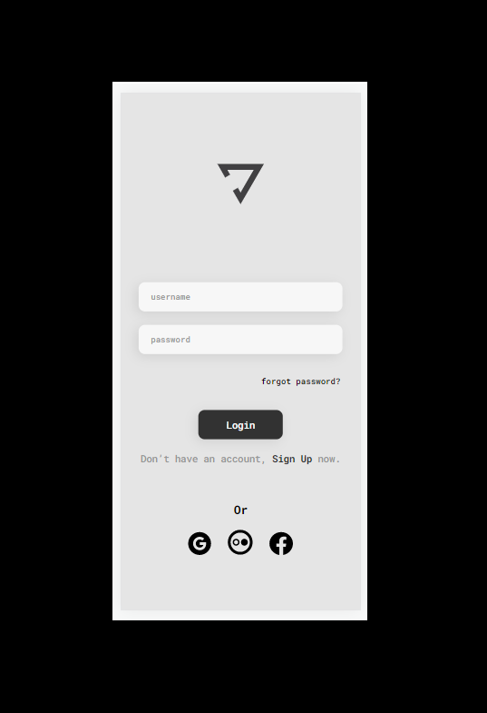

## Login project

> This project was created with HTML and CSS.

<!---Esses são exemplos. Veja https://shields.io para outras pessoas ou para personalizar este conjunto de escudos. Você pode querer incluir dependências, status do projeto e informações de licença aqui--->

> Visual result of the Yoga project login screen.

### Made of:

### Better config to view the login screen

The project was built on windows screen, but is possible to see how would be at cell phone screen following some instructions:

- Open the link in Google Chrome
- Click at right boton at your mouse on the option "inspect"
- Then press "Ctrl + Shift + M"

### 🤝 Contributors

We thank the following people who contributed to this project:

<table>
  <tr>
    <td align="center">
      <a href="#">
         
        
          <b>Sergio Cardoso</b>
        
      </a>
    </td>
     <td align="center">
      <a href="#">
         
        
          <b>Rodolfo Mori</b>
        
      </a>
    </td>
  </tr>
</table>

